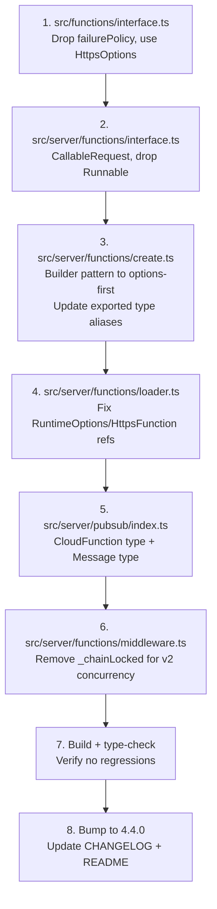

# Firebase Functions v1 → v2 Upgrade Analysis

## Current State

The project uses `firebase-functions@^7.0.5` but imports from the **`firebase-functions/v1`** subpath. The v1 API is used in 6 source files (excluding dist/coverage):

| File | Import | What's Used |
|---|---|---|
| [`functions/interface.ts`](../src/functions/interface.ts:1) | `type { RuntimeOptions }` from `firebase-functions/v1` | [`EndpointSettings`](../src/functions/interface.ts:9) type alias |
| [`server/functions/create.ts`](../src/server/functions/create.ts:1) | `* as functions` from `firebase-functions/v1` | `functions.runWith()`, `.https.onCall()`, `.https.onRequest()`, `.pubsub.schedule()`, `.pubsub.topic()` |
| [`server/functions/interface.ts`](../src/server/functions/interface.ts:2) | `* as functions` from `firebase-functions/v1` | `functions.https.CallableContext`, `functions.HttpsFunction`, `functions.Runnable` |
| [`server/functions/loader.ts`](../src/server/functions/loader.ts:1) | `type * as functions` from `firebase-functions/v1` | `functions.RuntimeOptions`, `functions.HttpsFunction` |
| [`server/pubsub/index.ts`](../src/server/pubsub/index.ts:1) | `type { pubsub, CloudFunction }` from `firebase-functions/v1` | `CloudFunction<pubsub.Message>` type |
| [`server/utils/AppHttpError.ts`](../src/server/utils/AppHttpError.ts:2) | `{ https }` from `firebase-functions` (root) | `https.HttpsError`, `https.FunctionsErrorCode` — **already v1/v2 compatible** |
| [`server/utils/LogicErrorAdapter.ts`](../src/server/utils/LogicErrorAdapter.ts:1) | `* as functions` from `firebase-functions` (root) | `functions.https.HttpsError`, `functions.https.FunctionsErrorCode` — **already v1/v2 compatible** |
| [`server/logger.ts`](../src/server/logger.ts:2) | `{ logger }` from `firebase-functions` (root) | `logger.log`, `.warn`, `.error` — **already v1/v2 compatible** |

---

## Key v1 → v2 API Differences

### Builder pattern → Options-first pattern

```ts
// v1 (current) – builder pattern
functions.runWith(options).https.onCall((data, ctx) => { ... });

// v2 – options-first parameter
import { onCall } from 'firebase-functions/v2/https';
onCall(options, (request) => { ... });
```

### `CallableContext` → `CallableRequest`

In v2, `onCall` receives a single `CallableRequest<T>` object where `data` is a property (not a separate parameter):

```ts
// v1: (data, context) => ...  where context has .auth, .rawRequest
// v2: (request) => ...        where request has .data, .auth, .rawRequest
```

### `EventContext` removed

Scheduled functions receive `ScheduledEvent` and pubsub receives `CloudEvent<MessagePublishedData>` instead.

### `HttpsFunction` & `Runnable` types changed

v2's `onCall` returns `CallableFunction<T, R>` — a different type hierarchy. `Runnable<T>` no longer exists.

### `RuntimeOptions` → `GlobalOptions` / `HttpsOptions`

Same fields (`memory`, `timeoutSeconds`, `minInstances`) but different type names. The `failurePolicy` field used in [`EndpointSettings`](../src/functions/interface.ts:9) is **not available** in v2 HTTPS options (it was for background functions only, and was never applicable to HTTPS callables).

### Unchanged APIs ✅

- `https.HttpsError` and `https.FunctionsErrorCode` — available in both v1 and v2
- `logger` from `firebase-functions` root — same API in v2

---

## Can We Keep the Same Public Interface?

**Yes.** The library's abstraction layer is well-designed enough that the consumer-facing interface can remain identical. The v1→v2 differences are almost entirely contained within internal plumbing files.

### What consumers actually interact with

Consumers interact with library-defined types, not raw Firebase types:

- [`EndpointContext`](../src/server/functions/interface.ts:8) — `ctx.input`, `ctx.output`, `ctx.auth`, `ctx.data`, `ctx.logger`, `ctx.rawRequest`, `ctx.endpoint`, `ctx.requestId`, `ctx.requestPath`
- [`EndpointFunction`](../src/server/functions/interface.ts:17) — `(data, context) => Promise<TOut>`
- [`EndpointHandler`](../src/server/functions/interface.ts:26) — `(ctx, next) => Promise<void>`
- [`Middleware`](../src/server/functions/middleware.ts:36) — `.use()`, `.useAuth()`, `.useFunction()`, etc.
- [`FunctionFactory`](../src/server/functions/factory.ts:18) / [`FunctionCompositeFactory`](../src/server/functions/composite.ts:38)
- [`FunctionDefinition`](../src/functions/definition.ts:8) / [`FunctionComposite`](../src/functions/composite.ts:42) / `spec<>()`
- [`AppHttpError`](../src/server/utils/AppHttpError.ts:4)
- [`SpecTo`](../src/server/functions/helpers.ts:8) / [`ContextTo`](../src/server/functions/helpers.ts:31)
- Client-side `Functions.create(def).execute(arg)`

None of these expose raw Firebase v1 types to consumers.

### Capability-by-capability compatibility

| Capability | v1 Mechanism | v2 Equivalent | Breaks Interface? |
|---|---|---|---|
| **HTTPS Callable** | `runWith(opts).https.onCall((data, ctx))` | `onCall(opts, (request))` | **No** — [`createHttpsCallFunction()`](../src/server/functions/create.ts:12) already destructures `data` and `ctx` before passing to middleware |
| **HTTPS Request** | `runWith(opts).https.onRequest(handler)` | `onRequest(opts, handler)` — same `(req, res)` signature | **No** |
| **Scheduled Functions** | `runWith(opts).pubsub.schedule(expr).onRun(ctx)` | `onSchedule(opts, (event))` | **No** — adaptable internally |
| **PubSub Topics** | `runWith(opts).pubsub.topic(name).onPublish((msg, ctx))` | `onMessagePublished(opts, (event))` | **No** — [`PubSub.Manager`](../src/server/pubsub/index.ts:16) wraps this; consumers only see `handler` Event and `publish()` |
| **Auth context** | `ctx.auth` on `CallableContext` | `request.auth` on `CallableRequest` | **No** — same shape `{ uid, token }` |
| **Raw request** | `ctx.rawRequest` on `CallableContext` | `request.rawRequest` on `CallableRequest` | **No** — same property |
| **Runtime options** | `RuntimeOptions` | `HttpsOptions` / `GlobalOptions` | **Minor** — drop `failurePolicy` from `EndpointSettings` (was unused for callables) |
| **HttpsError** | `functions.https.HttpsError` | Same class, same import | **No** |
| **Logger** | `firebase-functions` root logger | Same API | **No** |

---

## Files to Change

**5 source files** need modification. **0 public interfaces change.**

### 1. [`src/functions/interface.ts`](../src/functions/interface.ts)

```ts
// BEFORE
import type { RuntimeOptions } from 'firebase-functions/v1';
export type EndpointSettings = Pick<RuntimeOptions, 'memory' | 'timeoutSeconds' | 'minInstances' | 'failurePolicy'>;

// AFTER
import type { HttpsOptions } from 'firebase-functions/v2/https';
export type EndpointSettings = Pick<HttpsOptions, 'memory' | 'timeoutSeconds' | 'minInstances'>;
// Note: failurePolicy dropped — was never applicable to HTTPS callables
```

### 2. [`src/server/functions/create.ts`](../src/server/functions/create.ts)

Rewrite all 4 factory functions from builder pattern to v2 options-first pattern. Also update the exported type aliases that reference v1-specific types.

```ts
// BEFORE
import * as functions from 'firebase-functions/v1';

export type RequestEndpointFunction<TRes = any> = (req: functions.https.Request, resp: functions.Response<TRes>) => void | Promise<void>;
export type ScheduledFunction = ((context: functions.EventContext) => PromiseOrT<any>);
export type PubSubTopicListener = (message: functions.pubsub.Message, context: functions.EventContext) => PromiseOrT<any>;
export type SchedulerOptions = { timeZone?: string, runtime?: functions.RuntimeOptions };

function getBaseBuilder(runtimeOptions) {
    return functions.runWith({ ...GlobalRuntimeOptions.value, ...runtimeOptions });
}

export function createHttpsCallFunction(worker, options) {
    return getBaseBuilder(options).https.onCall((data, ctx) => {
        const eCtx = ctx as EndpointContext;
        return worker(data, eCtx);
    });
}

// AFTER
import { onCall, onRequest, type HttpsOptions, type Request } from 'firebase-functions/v2/https';
import { onSchedule, type ScheduleEvent } from 'firebase-functions/v2/scheduler';
import { onMessagePublished, type Message } from 'firebase-functions/v2/pubsub';
import type { Response } from 'express';

// Updated exported types — consumers of these types get v2 equivalents
export type RequestEndpointFunction<TRes = any> = (req: Request, resp: Response<TRes>) => void | Promise<void>;
export type ScheduledFunction = ((event: ScheduleEvent) => PromiseOrT<any>);
export type PubSubTopicListener = (message: Message, event: CloudEvent<MessagePublishedData>) => PromiseOrT<any>;
export type SchedulerOptions = { timeZone?: string, runtime?: HttpsOptions };

function mergeOptions(runtimeOptions?: HttpsOptions | null): HttpsOptions {
    return { ...GlobalRuntimeOptions.value, ...runtimeOptions };
}

export function createHttpsCallFunction(worker, options) {
    return onCall(mergeOptions(options), (request) => {
        // v2 CallableRequest has same .auth, .rawRequest as v1 CallableContext
        // but also has .data — we pass request as context, request.data as data
        const eCtx = request as EndpointContext;
        return worker(request.data, eCtx);
    });
}

export function createHttpsRequestFunction(worker, options) {
    return onRequest(mergeOptions(options), worker);
}

export function createScheduledFunction(schedule, worker, options) {
    return onSchedule({
        schedule,
        timeZone: options?.timeZone,
        ...mergeOptions(options?.runtime),
    }, (event) => worker(event));
}

export function createTopicListener(topicName, listener, options) {
    return onMessagePublished({
        topic: topicName,
        ...mergeOptions(options),
    }, (event) => listener(event.data.message, event));
}
```

> **Note on `RequestEndpointFunction`:** In v2, `onRequest` uses `Request` from `firebase-functions/v2/https` (Express-compatible) and `Response` from `express`. The `(req, res)` shape is the same, but the import paths change.

> **Note on `PubSubTopicListener`:** In v2, `event.data.message` is a `Message` from `firebase-functions/v2/pubsub`, not v1's `pubsub.Message`. The `.json` property exists on both, so the actual usage in [`pubsub/index.ts`](../src/server/pubsub/index.ts:62) (`message.json as TData`) works unchanged.

### 3. [`src/server/functions/interface.ts`](../src/server/functions/interface.ts)

```ts
// BEFORE
import * as functions from 'firebase-functions/v1';
export type BaseFunctionContext = functions.https.CallableContext;
export type FirebaseEndpoint = functions.HttpsFunction;
export type FirebaseEndpointRunnable = FirebaseEndpoint & functions.Runnable<any>;

// AFTER
import type { CallableRequest, HttpsFunction } from 'firebase-functions/v2/https';
// CallableRequest has .auth, .rawRequest, .app, .instanceIdToken — same as CallableContext
// It also adds .acceptsStreaming (harmless — passes through EndpointContext intersection)
export type BaseFunctionContext = Omit<CallableRequest<any>, 'data'>;
export type FirebaseEndpoint = HttpsFunction;
export type FirebaseEndpointRunnable = FirebaseEndpoint; // v2 doesn't have Runnable
```

> **Note on `BaseFunctionContext`:** v1 `CallableContext` has `{auth, rawRequest, instanceIdToken, app}`. v2 `CallableRequest<T>` has those same fields plus `data` and `acceptsStreaming`. Using `Omit<CallableRequest<any>, 'data'>` keeps the same shape consumers expect, with `acceptsStreaming` as a harmless addition that passes through the `EndpointContext` intersection type.

### 4. [`src/server/functions/loader.ts`](../src/server/functions/loader.ts)

This file uses `functions.RuntimeOptions` and `functions.HttpsFunction` as parameter and return types in public function signatures. These must be updated to v2 equivalents.

```ts
// BEFORE
import type * as functions from 'firebase-functions/v1';
// ...
export function createAsyncHttpsRequestFunction<TRes = any>(
    workerLoader: () => Promise<RequestEndpointFunction<TRes>>,
    options: functions.RuntimeOptions | null = null,
): functions.HttpsFunction {

// AFTER
import type { HttpsOptions, HttpsFunction } from 'firebase-functions/v2/https';
// ...
export function createAsyncHttpsRequestFunction<TRes = any>(
    workerLoader: () => Promise<RequestEndpointFunction<TRes>>,
    options: HttpsOptions | null = null,
): HttpsFunction {
```

> **Note:** The rest of `loader.ts` (async init loaders, `wrapLoaderFunction`, etc.) uses only library-defined types and needs no changes.

### 5. [`src/server/pubsub/index.ts`](../src/server/pubsub/index.ts)

```ts
// BEFORE
import type { pubsub, CloudFunction } from 'firebase-functions/v1';
// ...
private topicCloudFunctions: Record<string, CloudFunction<pubsub.Message>> = {};

// AFTER
import type { CloudFunction } from 'firebase-functions/v2/pubsub';
// ...
private topicCloudFunctions: Record<string, CloudFunction<any>> = {};
```

### Files that need NO changes ✅

- [`server/functions/middleware.ts`](../src/server/functions/middleware.ts) — no Firebase imports
- [`server/functions/factory.ts`](../src/server/functions/factory.ts) — uses library-defined types only
- [`server/functions/composite.ts`](../src/server/functions/composite.ts) — uses library-defined types only
- [`server/functions/helpers.ts`](../src/server/functions/helpers.ts) — uses library-defined types only
- [`server/utils/AppHttpError.ts`](../src/server/utils/AppHttpError.ts) — imports from root (compatible)
- [`server/utils/LogicErrorAdapter.ts`](../src/server/utils/LogicErrorAdapter.ts) — imports from root (compatible)
- [`server/logger.ts`](../src/server/logger.ts) — imports from root (compatible)
- All `client/` code — no server-side Firebase imports
- All `functions/` definitions — Firebase-agnostic (except `interface.ts`)

---

## Concurrency Consideration

v2 functions support **concurrency** (multiple requests per instance). The middleware chain is safe because:

- The chain is built at deploy time and is read-only during execution
- Each invocation gets its own `HandlerContext` object (created in [`FunctionFactory.createEndpointHandler()`](../src/server/functions/factory.ts:49))

**⚠️ Action required:** The [`_chainLocked`](../src/server/functions/middleware.ts:38) flag in [`Middleware.execute()`](../src/server/functions/middleware.ts:47) is instance-level, not invocation-level. With v2 concurrency, two concurrent requests on the same `FunctionFactory` could race on this boolean. While it's a guard (not a mutex) and only fires if `.use()` is called during execution (already a bug), it should be fixed for correctness:

```ts
// Option A: Remove the lock entirely (the chain is immutable after first request)
// Option B: Make it invocation-scoped via a local variable in execute()
public async execute(arg: TArg, endpointContext: EndpointContext<TContext>): Promise<TResult | null> {
    let chain = this._chain;
    // Remove this._chainLocked — not needed if chain is built before first request
    // ...
}
```

Recommendation: **Option A** — remove `_chainLocked` and `_checkChainLocked()` entirely. The chain is fully built at deploy time before any request arrives. The lock was a development-time safety net that becomes a concurrency hazard in v2.

---

## Versioning

This ships as **`4.4.0`** (minor bump). Breaking changes are permitted under minor versions for this package per project convention. Notable breaking changes for awareness:

1. `EndpointSettings.failurePolicy` is removed (was never applicable to HTTPS callables)
2. `FirebaseEndpointRunnable` type changes (no longer includes `Runnable<any>`)
3. v2 concurrency is a behavioral change at runtime
4. Exported types in `create.ts` change (`ScheduledFunction`, `PubSubTopicListener`, `SchedulerOptions`)
5. `loader.ts` public function signatures change (`RuntimeOptions` → `HttpsOptions`)

With ~zero live projects using functions, this is low-risk.

---

## New Capabilities Gained

| Feature | v1 | v2 |
|---|---|---|
| Concurrency | 1 request/instance | Configurable (up to 1000) |
| Max timeout | 9 minutes | 60 minutes |
| CPU configuration | Not configurable | `cpu` option |
| CORS | Manual | Built-in `cors` option |
| App Check | Manual | Built-in `enforceAppCheck` option |
| Min instances | ✅ | ✅ |
| Secrets | `runWith({ secrets })` | `defineSecret()` + options |

---

## Implementation Plan

### Step order



### Checklist

- [ ] Update [`src/functions/interface.ts`](../src/functions/interface.ts) — `RuntimeOptions` → `HttpsOptions`, drop `failurePolicy`
- [ ] Update [`src/server/functions/interface.ts`](../src/server/functions/interface.ts) — `CallableContext` → `CallableRequest`, `HttpsFunction` from v2, drop `Runnable`
- [ ] Rewrite [`src/server/functions/create.ts`](../src/server/functions/create.ts) — v2 options-first pattern, update all exported type aliases
- [ ] Update [`src/server/functions/loader.ts`](../src/server/functions/loader.ts) — `functions.RuntimeOptions` → `HttpsOptions`, `functions.HttpsFunction` → `HttpsFunction` from v2
- [ ] Update [`src/server/pubsub/index.ts`](../src/server/pubsub/index.ts) — `CloudFunction` from v2, drop `pubsub.Message` type param
- [ ] Remove `_chainLocked` / `_checkChainLocked()` from [`src/server/functions/middleware.ts`](../src/server/functions/middleware.ts) for v2 concurrency safety
- [ ] Verify build passes with `tsc --noEmit`
- [ ] Run existing tests
- [ ] Bump version to `4.4.0` in [`package.json`](../package.json)
- [ ] Update [`README.md`](../README.md) — change "functions (v1)" references to v2

---

## Decision: No Dual-Version Support

The original analysis explored three approaches (A/B/C) for letting consumers choose between v1 and v2. **Decision: skip dual-version support.** Rationale:

1. **~Zero live projects** use the functions layer — there's no migration burden
2. **Semver handles this** — consumers needing v1 pin `@zajno/common-firebase@^4`
3. **v1 is effectively deprecated** by Google — no new features, all docs/tooling default to v2
4. **No new project should use v1** — v2 is strictly superior in every dimension
5. **The adapter layer adds complexity** for a migration path nobody needs — YAGNI

If dual-version support is ever needed in the future, the library's clean separation makes it straightforward to introduce at that point.

---

## Summary

The upgrade is **feasible with the same consumer-facing interface**. The library's clean separation between the middleware/context layer and the Firebase SDK layer makes this a contained change affecting **5 internal files** plus an optional concurrency fix in `middleware.ts`. No consumer handler code, definitions, or middleware chains need modification.

This ships as `v4.4.0` with v2-only support. The `4.3.x` line remains available for any legacy v1 needs via version pinning.
